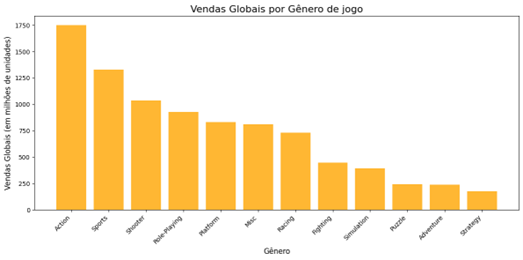

# Análise de Vendas de Video Games
 
 

## 📌 Descrição

> Este projeto se propõe a analisar o que contribui para o sucesso de vendas de um jogo de video game: O gênero do jogo, a avaliação que especialistas fazem do jogo, as notas que os usuários dão ao jogo, ou será que o produtor do jogo é o segredo para o sucesso nas vendas?

---
## 🚀 Tecnologias Utilizadas:
> - Google Colab
> - Python (Pandas, Matplotlib)
> - Kaggle

---
## 📊 Etapas do Projeto
> **Obtenção dos dados** - Busca na plataforma [Kaggle](https://www.kaggle.com/datasets) pelo tema: vendas video games;
> **Limpeza e Pré-processamento** - Tratamento de dados nulos, remoção de linhas duplicadas, normalização de dados;
> **Análise Exploratória (EDA)** - visualizações e insights iniciais;
> **Conclusões e Insighte** - principais resultados obtidos.

---
## 📷 Resultados e Visualizações

Gráfico de barras apresentando o volume de vendas de jogos por gênero. É um dos gráficos que usei no projeto.

---
##  📦 Como Executar o Projeto

### Iniciar controle de versão com git
git init

### Clonar o repositório
git clone https://github.com/guedesindev/Analise-de-Vendas-de-Video-Games.git

### Entrar na pasta
cd Analise-de-Vendas-de-Video-Games

### Executar o notebook
Caso use o jupyter notebook:
abrir o terminal e executar o comando: jupyter notebook

Caso tenha a extensão do jupyter no VsCode basta abrir o notebook no seu VsCode.

Caso utilize o Google Collab, basta fazer upload do notebook e abrir lá.

---
⚠️ Para quem nunca usou o google collab, é muito semelhante ao jupter notebook necessário executar as células de cima para baixo para tornar as variáveis disponíveis.

---
📚 Referências
[Documentação Pandas](https://pandas.pydata.org/docs/)
[Documentação Scikit-learn](https://matplotlib.org/stable/)

---
📄 Licença
Este projeto está sob a licença MIT — veja o arquivo LICENSE para mais detalhes.
